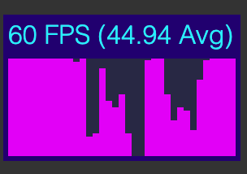

[![Contributors][contributors-shield]][contributors-url]
[![Forks][forks-shield]][forks-url]
[![Stargazers][stars-shield]][stars-url]
[![Issues][issues-shield]][issues-url]
[![MIT License][license-shield]][license-url]

<br />
<p align="center">
  <a href="https://github.com/JohannesKlauss/react-fps">
    
  </a>

  <h3 align="center">react-fps</h3>
</p>

## Table of Contents

* [About the Project](#about-the-project)
* [Getting Started](#getting-started)
  * [Installation](#installation)
  * [TypeScript](#typescript)
* [Usage](#usage)
  * [Component](#component)
  * [Props](#props)
  * [Hook](#hook)
* [Roadmap](#roadmap)
* [Contributing](#contributing)
* [License](#license)
* [Contact](#contact)
* [Prior Art](#prior-art)

## About the Project
`react-fps` is a tool to analyze your apps performance. Simply add the component
or use the exported hook to create your own visualization.

### Features
* Includes the above UI component for logging FPS without any hassle.
* Exports a `useFps` hook to create your own customized UI.
* Also tracks main thread blocks and idle times.

## Getting Started
### Installation
```shell script
yarn add react-fps
```

```shell script
npm i react-fps
```

### TypeScript

This package is built with TypeScript and supports it out of the box.

## Usage

### Component
To use the built in UI component seen above, just use the `FpsView` component:
```jsx harmony
import React from "react";
import {FpsView} from "react-fps";

export function YourComponent() {
  // ....
  
  return (
    // ...
    <FpsView/>
    // ...
  );
}
```

### Props
By default the component will appear in the upper left corner with a dimension
of 140x60 pixels. You can of course modify that via props:

```jsx harmony
import React from "react";
import {FpsView} from "react-fps";

export function YourComponent() {
  // ....
  
  return (
    // ...
    <FpsView width={240} height={180} left={60} top={80}/>
    // ...
  );
}
```

You can also use `bottom` and `right` to position it relative to those borders.

```jsx harmony
import React from "react";
import {FpsView} from "react-fps";

export function YourComponent() {
  // ....
  
  return (
    // ...
    <FpsView width={240} height={180} bottom={60} right={80}/>
    // ...
  );
}
```

### Hook
```typescript
useFps(windowWidth: number): {fps: number[], avgFps: number, maxFps: number, currentFps: number};
```

#### Params
* `windowWidth` defines the number of kept values. So `3` saves the last
three fps values, `20` will save the last twenty. This also is the base
the average and maximum calculation.

**Note!** `windowWidth` roughly equals to seconds passed. So a window of
`20` is approximately a window of 20 seconds. But there is absolutely no
guarantee that this will be the case.

#### Return Values
* `fps` is an array of fps numbers. Most recent value is the last one.
* `avgFps` is the average frame rate over the defined window.
* `maxFps` is the maximum frame rate recorded over the defined window.

#### Usage
To use the hook, just import it into your component.

```typescript
import {useFps} from 'react-fps';

function YourComponent() {
  const {fps, avgFps, maxFps, currentFps} = useFps(20);
  
  // ....
}
```

And then you can build the UI visualization of your dreams.

## Roadmap
[ ] - Implement a hook version that updates itself every frame.

## Contributing
Contributions are what make the open source community such an amazing place to be learn, inspire, and create. Any contributions you make are **greatly appreciated**.

1. Fork the Project
2. Create your Feature Branch (`git checkout -b feature/AmazingFeature`)
3. Commit your Changes (`git commit -m 'Add some AmazingFeature'`)
4. Push to the Branch (`git push origin feature/AmazingFeature`)
5. Open a Pull Request

## License
Distributed under the MIT License. See `LICENSE` for more information.

## Contact

Johannes Klauss - [@JohannesKlauss](https://github.com/JohannesKlauss) - klauss.johannes@gmail.com

Project Link: [https://github.com/JohannesKlauss/react-fps](https://github.com/JohannesKlauss/react-fps)

## Prior Art
Basis of this package is the [react-fps-stats](https://github.com/tibotiber/react-fps-stats)  
package which itself is a fork of [react-stats](https://github.com/sebslomski/react-stats).
I ported it to use hooks, added a nicer color layout and made it more customizable.

## Found an issue or want a feature?
Just open up an issue

## A
